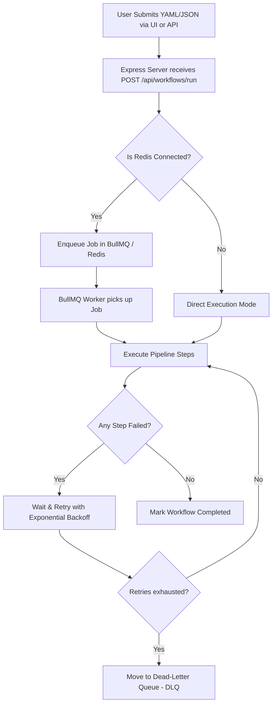

# Event Flow Orchestration Engine: Deep Dive

This document answers why we are using specific technologies (like Redis and BullMQ), how they are integrated, how to test the application, and the rationale behind our tech stack.

---

## 1. Why are we using Redis & BullMQ?

In a standard Node.js server, everything runs inside a single process. If you trigger a heavy workflow, the server might freeze. If the server crashes mid-execution, your running tasks are lost forever.

To solve this, we use **Redis** and **BullMQ**:
* **Redis (The Scratchpad)**: Redis is a super-fast, in-memory database. We use it to store a list of jobs waiting to be done. It acts as our queue database.
* **BullMQ (The Manager)**: BullMQ is a library that manages queues inside Redis.
  * **Reliability**: If your server crashes or restarts, BullMQ reads from Redis and picks up right where it left off.
  * **Throttling (Concurrency Control)**: It limits how many tasks run at once (e.g., maximum 100 tasks).
  * **Retries & Backoff**: If a step fails, BullMQ automatically schedules it to run again later (with delays).

---

## 2. How are they connected to our project?

We have integrated them through a dedicated layer:
1. **Connection**: [QueueManager.js](file:///c:/Users/NEEHARIKA%20JHA/Desktop/projects/Event-Flow-Orchestration-Engine/engine/QueueManager.js) imports `bullmq` and connects to Redis using the `ioredis` library.
2. **Worker Registration**: [WorkflowQueue.js](file:///c:/Users/NEEHARIKA%20JHA/Desktop/projects/Event-Flow-Orchestration-Engine/engine/WorkflowQueue.js) creates a BullMQ **Worker** that listens for incoming workflow jobs.
3. **Execution**: When a job is pulled off the queue, it triggers the core engine (`processus.runWorkflow`) to execute your pipeline steps.
4. **Graceful Fallback**: If Redis is not running (e.g. during local testing), [server.js](file:///c:/Users/NEEHARIKA%20JHA/Desktop/projects/Event-Flow-Orchestration-Engine/server.js) catches the connection error and automatically switches to **Direct Execution Mode**. This bypasses Redis entirely and processes tasks in memory.

---

## 3. What does it do & How does it work?

Here is the exact lifecycle of a workflow run:



---

## 4. Why this stack? (Rationale)

We chose this stack because it represents modern, industry-standard backend and frontend design:

| Technology | Why we use it |
| :--- | :--- |
| **Node.js & Express** | Incredibly lightweight, easy to write, and fast at handling thousands of simultaneous HTTP requests. |
| **Redis & BullMQ** | The most reliable and battle-tested queuing system in the Node.js ecosystem, processing millions of jobs daily in production. |
| **TypeScript** | Adds strict data types to Javascript. It catches bugs in our editor before the code even runs, making the codebase highly reliable. |
| **Tailwind CSS v4** | A utility-first CSS framework. It lets us style our dashboard directly inside our files without writing messy, custom CSS rules. |
| **Vite** | The fastest build tool available today. It compiles our TypeScript and builds our Tailwind utilities in milliseconds. |

---

## 5. How to test the entire system

Follow these steps to test both **Direct Mode** and **Queue Mode**:

### Step A: Test Direct Mode (Without Redis)
1. Run `node server.js`.
2. Notice the warning: `⚠️ Failed to initialize engine with Queue support (Redis may not be running)`.
3. Open `http://localhost:3000`.
4. Go to **Trigger Pipeline**, choose a template, and click **Execute Pipeline**.
5. Go to **Execution Audit** to verify the run completed successfully.

### Step B: Test Queue Mode (With Redis)
1. Install and start Redis locally (e.g., using Docker or a local installation):
   ```bash
   docker run -d -p 6379:6379 redis
   ```
2. Restart the server: `node server.js`.
3. Notice the success message: `🚀 Orchestration Engine initialized successfully with Queue support (Redis)`.
4. Submit a pipeline in the UI. It will now be processed reliably through BullMQ.
